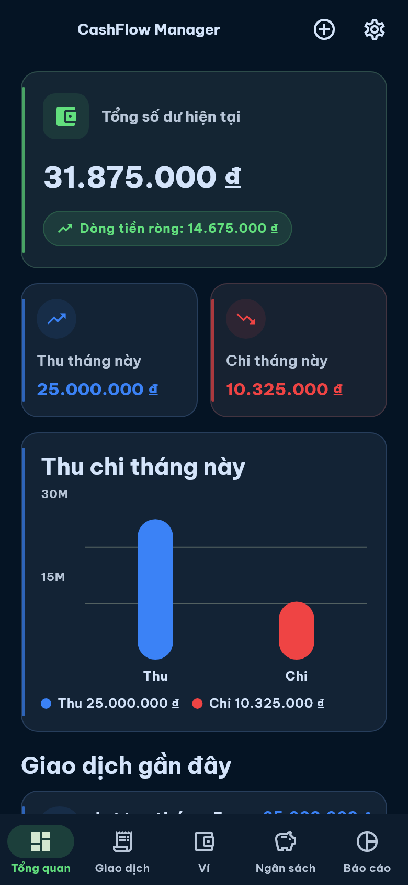
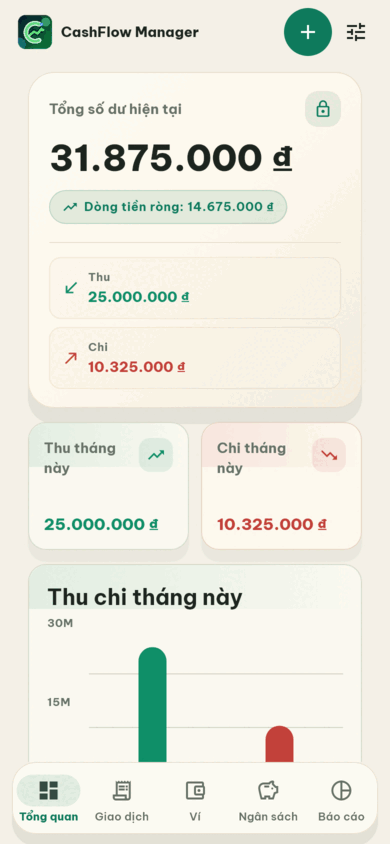
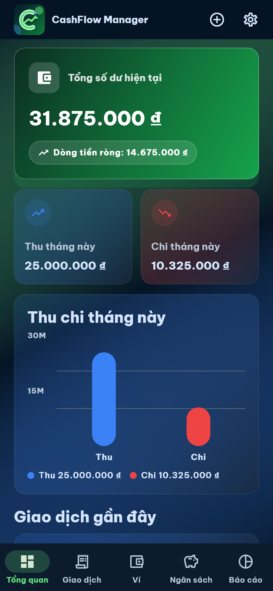
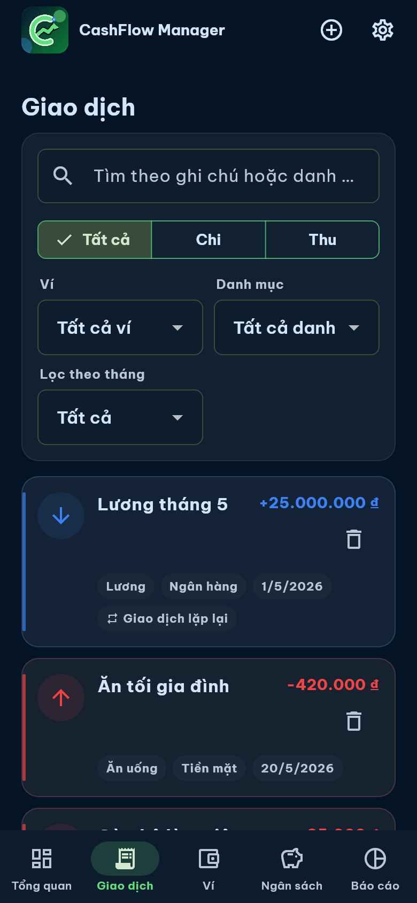
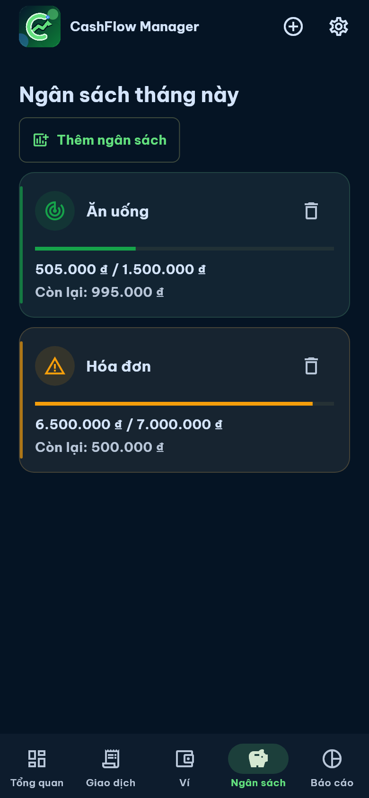
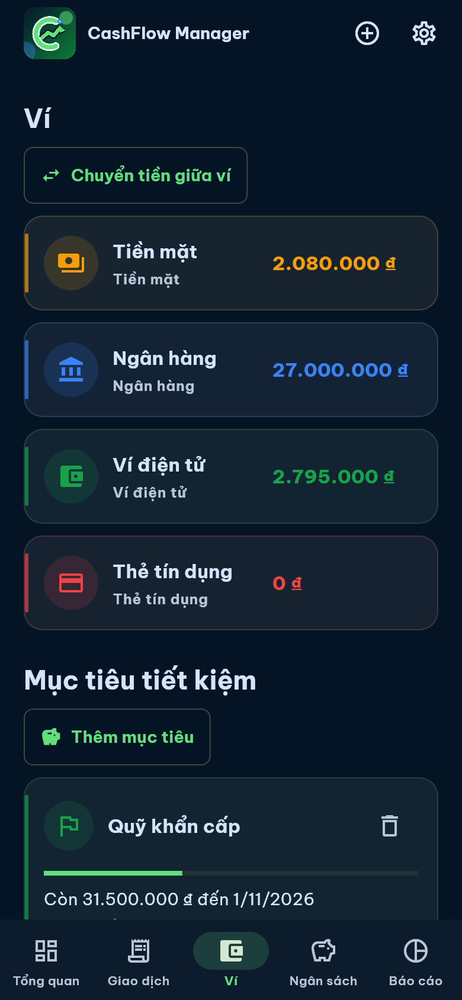
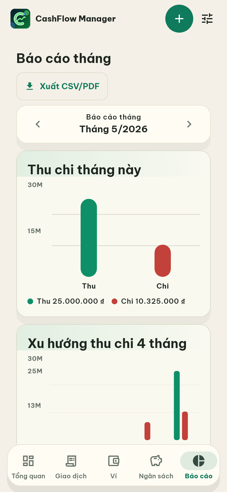
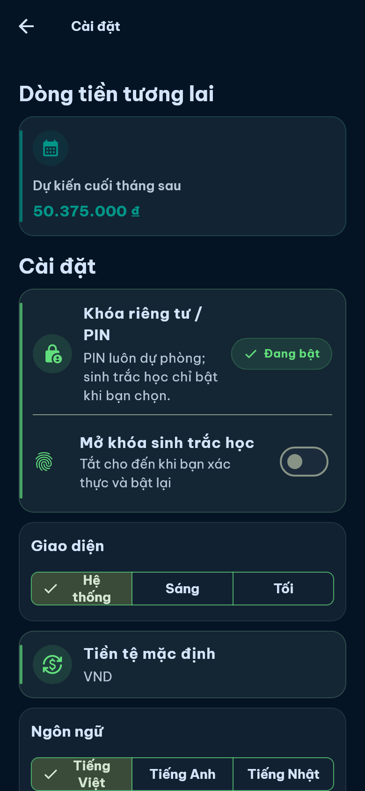

# CashFlow Manager

<p align="center">
  
</p>

<p align="center">
  <strong>Offline-first personal finance for Vietnamese, English, and Japanese users.</strong>
</p>

<p align="center">
  <a href="README.md">English</a> · <a href="README.vi.md">Tiếng Việt</a> · <a href="README.ja.md">日本語</a>
</p>


CashFlow Manager is an offline-first Flutter app for Android and iOS that helps users manage personal expenses, wallets, budgets, cashflow forecasts, saving goals, and monthly reports in Vietnamese, English, and Japanese.

## Demo





| Dashboard | Transactions | Budgets |
|---|---|---|
|  |  |  |

| Wallets | Reports | Privacy settings |
|---|---|---|
|  |  |  |

## About

CashFlow Manager demonstrates a release-ready mobile finance architecture: local SQLite persistence, integer VND money logic, Riverpod state management, privacy-first PIN and opt-in biometric protection, PDF/CSV/backup flows, a separate Fastify/Prisma API, PostgreSQL-backed validation through Docker Compose, OpenAPI documentation, and an optional n8n HMAC automation workflow.

The Flutter app is useful without accounts, network access, PostgreSQL, or n8n. The backend and automation stack are production-style foundations for authenticated sync and AI-assisted analysis, not a requirement for local-first usage.

## Feature Highlights

### Personal finance

- Dashboard with current balance, monthly income, monthly expense, net cashflow, chart, recent transactions, and budget alerts.
- Five bottom tabs cover Dashboard, Transactions, Wallets, Budgets, and Reports; app-bar actions handle Add transaction and Settings without a floating action button overlay.
- Income/expense transaction management with wallet, category, date, note, recurring flag, validation, search, and filters.
- Wallet overview for cash, bank, e-wallet, and credit-card-ready models.
- Wallet transfer flow with same-wallet validation.
- Monthly budget create/edit/delete flow with warning threshold logic.
- Saving goals with create/edit/delete flow and monthly saving suggestions.
- Reports with selected-month navigation, income/expense chart, category pie, top spending, forecast cards, CSV preview, and PDF sharing.

### Privacy and safety

- Hardened PIN hashing with salted PBKDF2-HMAC-SHA256.
- Failed PIN attempt cooldown and reset after successful unlock.
- Lifecycle relock when the app leaves foreground.
- Opt-in biometric unlock through `local_auth`, with PIN always available as fallback.
- Re-authentication before destructive flows such as reset data and backup restore.
- Backup restore preview with file-size and data-shape validation before replacement.
- CSV export formula escaping to reduce spreadsheet injection risk.

### Production-style platform work

- Separate `api` service using Fastify, Prisma, PostgreSQL, JWT/JWKS, and OpenAPI.
- Docker Compose stack for PostgreSQL, API, frontend artifact server, migrations, seed job, and optional n8n automation.
- n8n workflow import/activation path with HMAC request verification before AI provider calls.
- GitHub Actions CI for Flutter, API, PostgreSQL migration/seed, Docker image builds, Android release artifacts, and Docker Hub and GHCR publishing.

## Architecture

```text
Flutter mobile app (offline-first)
  ├─ Riverpod controllers
  ├─ SQLite local finance store
  ├─ Finance calculator and export services
  ├─ Privacy lock service
  └─ Optional remote sync client
        ↓ HTTPS / OpenAPI
Fastify API service
  ├─ Auth + JWKS
  ├─ Finance validation routes
  ├─ Sync bootstrap foundation
  ├─ Optional n8n AI analysis proxy
  └─ PostgreSQL persistence
        ↓ HMAC webhook
n8n automation
  └─ OpenAI-compatible chat completions workflow
```

API contract: [`docs/openapi.yaml`](docs/openapi.yaml)

## Tech Stack

- Flutter 3.44 / Dart 3.12
- Riverpod for state management
- SQLite via `sqlite3` + `sqlite3_flutter_libs`
- `fl_chart` for charts
- `local_auth` + `flutter_secure_storage` for local lock
- `csv`, `pdf`, `printing`, `share_plus`, `file_picker` for export and backup flows
- Fastify + Prisma API for authenticated PostgreSQL-backed sync foundation and AI analysis proxy
- Docker Compose with PostgreSQL 16, migration/seed jobs, API, frontend artifact server, and optional n8n automation
- GitHub Actions CI for Flutter analyze/tests/builds, API Prisma/typecheck/tests/build, PostgreSQL migration/seed validation, Docker image builds, Android release artifacts, and Docker Hub and GHCR publishing

## Quick Start

```bash
flutter pub get
flutter analyze
flutter test
flutter run
```

## Backend API

```bash
npm --prefix api install
npm --prefix api run prisma:generate
npm --prefix api run typecheck
npm --prefix api test
```

With Docker Desktop running, apply migrations, seed demo data, then start separate backend and frontend containers plus PostgreSQL:

```bash
docker compose up --build -d postgres
docker compose --profile tools run --rm --build migrate
docker compose --profile tools run --rm --build seed
docker compose up --build -d api frontend
```

- `api` builds from `api/Dockerfile` and serves the Fastify backend on container port `3000`.
- `frontend` builds from `Dockerfile.frontend` and serves the Android APK artifact on container port `8080`.
- `postgres` runs PostgreSQL 16 for backend validation.
- `migrate` and `seed` use the Dockerfile `tools` target so Prisma CLI stays available without bloating the API runtime image.

If host port `3000` is already in use, keep the API container on `3000` and remap only the host port:

```powershell
$env:API_HOST_PORT = '3001'
docker compose up --build
```

If host port `8080` is already in use, remap the frontend artifact server:

```powershell
$env:FRONTEND_HOST_PORT = '8081'
docker compose up --build
```

The API exposes `/healthz`, `/readyz`, `/.well-known/jwks.json`, auth/account routes, finance CRUD routes, sync bootstrap/changes/push routes, household/shared-budget foundations, entitlement/payment foundations, and an optional n8n-backed `/v1/ai/analysis` endpoint. `/readyz` checks the migrated application schema, so run `migrate` before treating the API as ready. The mobile app release version (`1.0.0+1`) and backend/API package version (`0.1.0`) are versioned independently.

## Optional n8n ChatbotAI Workflow

```powershell
$env:N8N_CHATBOT_WEBHOOK_URL = 'http://n8n:5678/webhook/cashflow-ai-analysis'
$env:N8N_CHATBOT_WEBHOOK_SECRET = 'replace-with-local-webhook-hmac-secret'
$env:N8N_ENCRYPTION_KEY = 'replace-with-local-n8n-encryption-key'
$env:N8N_AI_CHAT_COMPLETIONS_URL = 'https://api.openai.com/v1/chat/completions'
$env:N8N_AI_API_KEY = '<local-ai-api-key>'
$env:N8N_AI_MODEL = 'gpt-4o-mini'
docker compose --profile automation up --build -d n8n-postgres n8n
docker compose --profile automation run --rm n8n-import
docker compose --profile automation run --rm n8n-activate
docker compose --profile automation restart n8n
```

The imported workflow at `infra/n8n/workflows/cashflow-ai-analysis.json` verifies `x-cashflow-signature-sha256` before calling an OpenAI-compatible chat completions endpoint. ChatbotAI is a conservative finance coach, not a bank/account data agent: it must not claim access to bank accounts, transactions, wallets, files, external services, or hidden app data. After HMAC verification, the provider prompt receives only `{ question, locale }`, and the workflow/API response contract is strict JSON `{ answer, suggestions }` with 3-5 non-empty suggestions. Keep real AI provider tokens only in local `.env` files or deployment secrets.

For a token-free local smoke test, run a mock provider in one terminal and point n8n at it before importing the workflow:

```powershell
node scripts/mock-openai-compatible-provider.mjs
$env:N8N_AI_CHAT_COMPLETIONS_URL = 'http://host.docker.internal:4567/v1/chat/completions'
$env:N8N_AI_API_KEY = 'local-mock-token'
$env:N8N_AI_MODEL = 'local-mock-model'
$env:N8N_CHATBOT_WEBHOOK_SECRET = 'replace-with-local-webhook-hmac-secret'
docker compose --profile automation up --build -d n8n-postgres n8n
docker compose --profile automation run --rm n8n-import
docker compose --profile automation run --rm n8n-activate
.\scripts\smoke-test-n8n-ai.ps1
```

Run the mock-provider smoke before any real AI-provider token test. The smoke script first proves an invalid signature is rejected with zero provider calls, then sends a valid HMAC-signed request and expects exactly one provider call plus `{ answer, suggestions }` with 3-5 non-empty suggestions.

Troubleshooting:

| Symptom | Likely cause | Fix |
|---|---|---|
| `ai_analysis_unconfigured` | API is missing `N8N_CHATBOT_WEBHOOK_URL` or `N8N_CHATBOT_WEBHOOK_SECRET` | Set local env or deployment secrets and restart the API |
| Invalid HMAC smoke fails | Secret mismatch between the smoke script/API and n8n | Use the same local placeholder secret on both sides |
| Provider returns 401 | `N8N_AI_API_KEY` is invalid or missing | Replace it only in a local `.env` file or deployment secret store |
| n8n import fails | Docker daemon, n8n database, or workflow import job is not ready | Re-run after Docker responds and inspect `docker compose logs n8n n8n-postgres` |

## Release and Package Story

### Android

```bash
flutter build apk --debug
flutter build appbundle --debug
flutter build apk --release
flutter build appbundle --release
```

Release signing requires standard Android keystore setup outside this repo. Do not commit keystores or passwords.

Suggested GitHub Release artifacts:

- `cashflow-manager-v1.0.0-android.apk`
- `cashflow-manager-v1.0.0-android.aab`
- `sbom.spdx.json` after release security scanning is finalized

### iOS

The iOS structure exists under `ios/`. Build/archive requires macOS with Xcode and Swift installed:

```bash
flutter pub get
flutter build ios --release
```

Then archive through Xcode or Fastlane on a macOS runner.

### Docker images

The intended public container image names are:

- Docker Hub: `nguyenson1710/cashflow-manager-api`
- Docker Hub: `nguyenson1710/cashflow-manager-frontend`
- GHCR: `ghcr.io/jasontm17/cashflow-manager-api`
- GHCR: `ghcr.io/jasontm17/cashflow-manager-frontend`

Image publishing should push `latest`, git SHA, and semver tags on release tag builds after CI/release gates pass.

## Test

```bash
flutter analyze
flutter test --no-pub -r expanded
flutter test --no-pub scripts/capture_demo_media_test.dart -r expanded
```

Current coverage focus:

- Money parsing and VND formatting edge cases.
- Wallet balance logic across income, expense, and transfer.
- Budget warning logic.
- Saving goal monthly suggestion.
- Empty export behavior and PDF payload generation.
- Privacy lock setup/unlock/relock, biometric opt-in, PIN cooldown, destructive-flow re-auth, dashboard, transaction, wallet transfer, budget, goal, report, export, and backup widget flows.
- Demo screenshot generation from deterministic fake financial data.

## Project Structure

```text
api/                   # Fastify/Prisma backend for authenticated sync and AI analysis
infra/n8n/             # Versioned n8n workflow import/activation assets
lib/
  app/                 # Theme, localization, app-level setup
  core/                # Finance models, money math, export, privacy lock, sync DTOs
  data/                # Local SQLite store
  features/home/       # Riverpod controller and main mobile UI
scripts/               # Utility scripts, including demo media capture
test/                  # Unit and widget tests
docs/                  # Product, technical, database, UI, test, release docs, media
.github/workflows/     # CI
```

## Repository Presentation Checklist

Use this when preparing the GitHub repository page:

- About: `Offline-first Flutter personal finance manager with privacy lock, SQLite, Docker/PostgreSQL API, OpenAPI, and n8n HMAC automation.`
- Website/homepage: `https://github.com/JasonTM17/Money_Management_App#readme` until a real public release/download page exists.
- Topics: `dart`, `docker`, `fastify`, `flutter`, `n8n`, `openapi`, `personal-finance`, `postgresql`, `prisma`, `riverpod`, `sqlite`.
- Pin screenshots/GIF from `docs/media/` in the README.
- No GitHub Releases are published yet; publish only from signed release tags after CI, release signing, SBOM, and checksum gates pass.
- Packages/containers are not published or visible yet; verify Docker Hub and GHCR only after release gates pass for the API and frontend images.
- Do not publish secrets, signing assets, local databases, private automation files, or internal planning notes.

## Privacy Notes

Financial data is local-first. PINs use salted PBKDF2-HMAC-SHA256 before storing in secure storage, biometric unlock is opt-in, repeated failed PIN attempts trigger a cooldown, and the privacy gate relocks when the app leaves foreground. Destructive flows such as data reset and backup restore require re-authentication before replacing local financial data. Backup/restore and report export flows warn about sensitive financial data. Secret files, signing assets, local databases, private automation files, and internal planning notes stay out of git.

## Known Limitations

- No production cloud sync yet; the app remains offline-first, and server sync/account pieces are release foundations until a separate sync rollout.
- Supabase/Firebase sync is intentionally out of MVP scope.
- Receipt image/OCR remains local-first work for the next product phase.
- iOS release archive cannot be verified on Windows; use macOS/Xcode.
- `file_picker` and `share_plus` still emit Flutter's future Kotlin Gradle Plugin migration warning during Android release builds.
