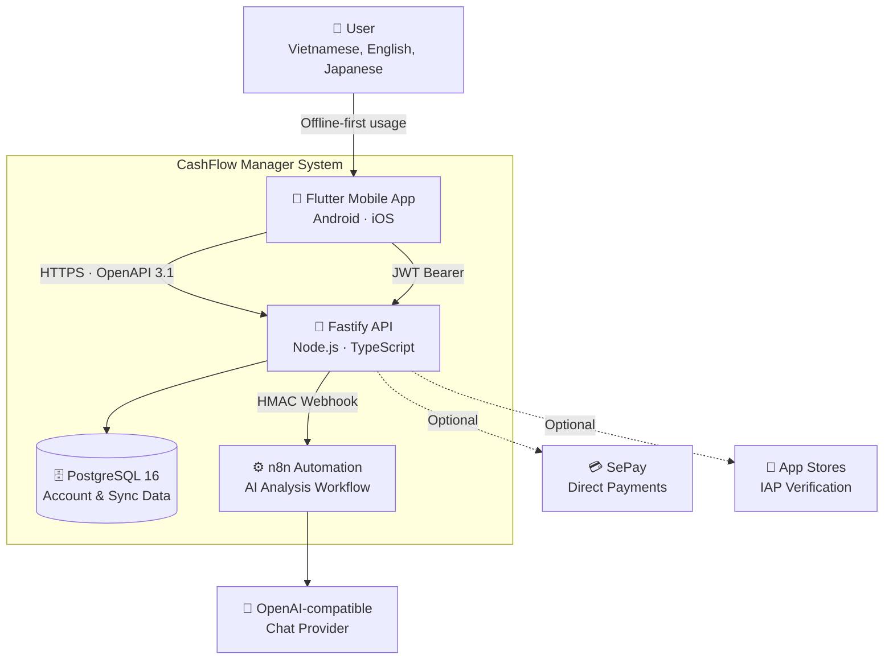
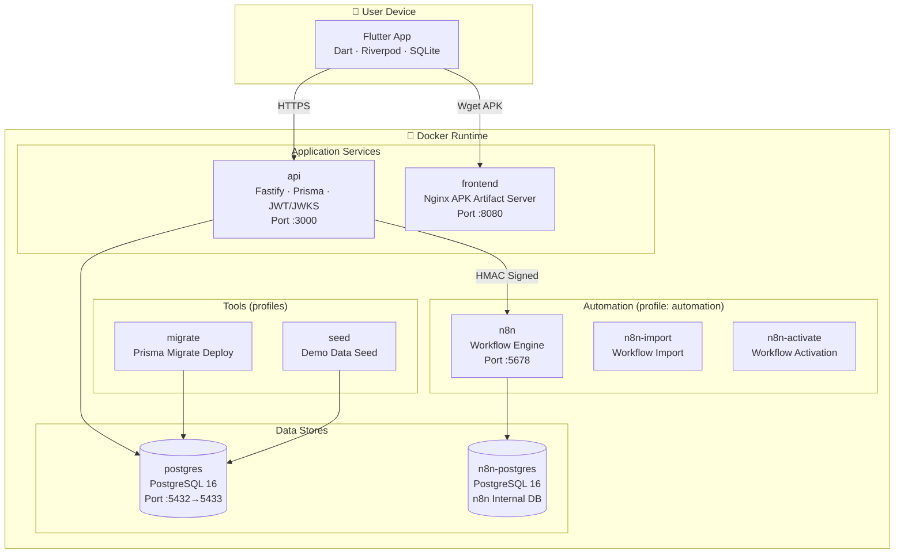
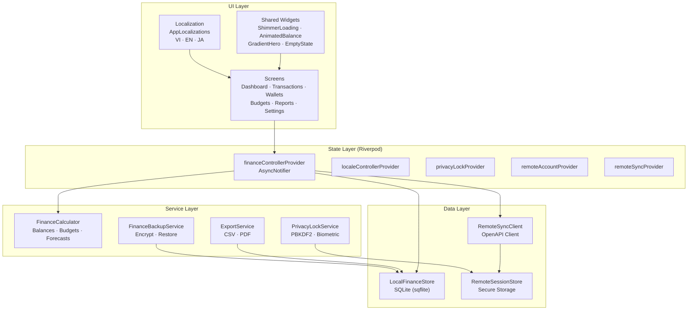
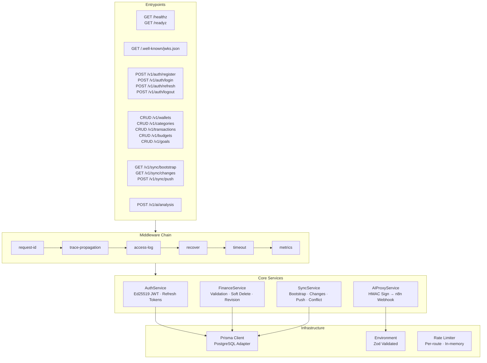
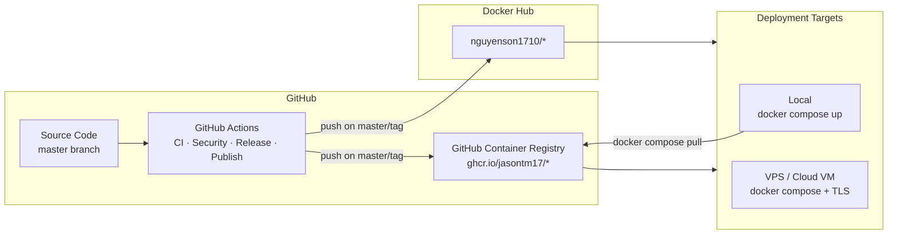

# System Architecture / Kiến trúc hệ thống / システムアーキテクチャ

CashFlow Manager follows the **C4 model**: Context → Container → Component → Code. Diagrams use Mermaid.js v11.

## C4 Level 1 — System Context

**Key relationships:**
- The mobile app works **completely offline** without any backend connection
- The API is only needed for **optional account sync** and **AI analysis**
- n8n automation is **optional** — gated behind Docker profile `automation`
- SePay and IAP verification are **optional payment foundations**

## C4 Level 2 — Container

**Container details:**

| Container | Image | Port | Healthcheck |
|-----------|-------|------|-------------|
| `api` | `Dockerfile` (multi-stage, Node 22 distroless) | 3000 | `GET /healthz` |
| `frontend` | `Dockerfile.frontend` (nginx:alpine) | 8080 | Wget APK artifact |
| `postgres` | `postgres:16-alpine` | 5433→5432 | `pg_isready` |
| `n8n` | `n8nio/n8n:1.121.3` | 5678 | `GET /healthz` |
| `n8n-postgres` | `postgres:16-alpine` | internal | `pg_isready` |
| `migrate` | `api/Dockerfile` tools target | — | One-shot |
| `seed` | `api/Dockerfile` tools target | — | One-shot |

## C4 Level 3 — Flutter Component

## C4 Level 3 — Fastify API Component

## Deployment View

## Technology Stack

| Layer | Technology | Purpose |
|-------|-----------|---------|
| Mobile Framework | Flutter 3.44 · Dart 3.12 | Cross-platform UI |
| State Management | Riverpod 2.x | Reactive state |
| Local Database | SQLite (sqflite) | Offline-first storage |
| API Runtime | Fastify 5.x · Node.js 22 | REST API server |
| ORM | Prisma 7.8 | Type-safe DB access |
| Auth | Ed25519 JWT · JWKS | Asymmetric signing |
| Database | PostgreSQL 16 | Server-side persistence |
| Automation | n8n 1.121 | AI workflow orchestration |
| Frontend Serve | Nginx Alpine | APK artifact hosting |
| CI/CD | GitHub Actions | Test · Build · Publish |
| Container Registry | GHCR · Docker Hub | Image distribution |
| API Contract | OpenAPI 3.1 | Source of truth |
| Monitoring | Healthz · Readyz · /metrics | Observability endpoints |

## Key Architectural Decisions

See [ADR index](adr/) for full decision records:

| ADR | Decision |
|-----|----------|
| [0001](adr/0001-record-architecture-decisions.md) | Record architecture decisions |
| [0002](adr/0002-offline-first-architecture.md) | Offline-first: local SQLite, no mandatory backend |
| [0003](adr/0003-ed25519-jwt-auth.md) | Ed25519 asymmetric JWT with JWKS publication |
| [0004](adr/0004-integer-financial-amounts.md) | All money values stored as integers (VND) |

## Design Principles

1. **Offline-first**: App fully functional without network, account, or backend
2. **Sync is opt-in**: Remote sync never blocks or corrupts local data
3. **Separation of concerns**: Flutter/API/n8n are independent deployable units
4. **Contract-first**: OpenAPI 3.1 is canonical; generated clients eliminate drift
5. **Security by default**: PIN hash, encrypted backup, HMAC webhooks, JWT rotation
6. **Integer money**: All financial amounts are integers — no floating-point
