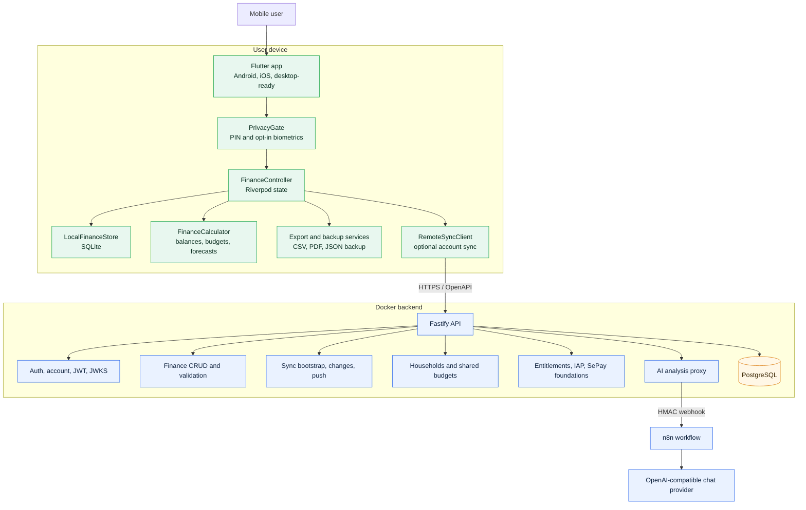
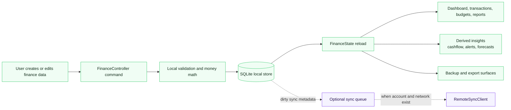
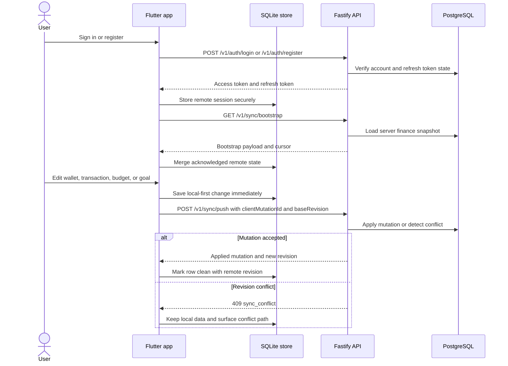
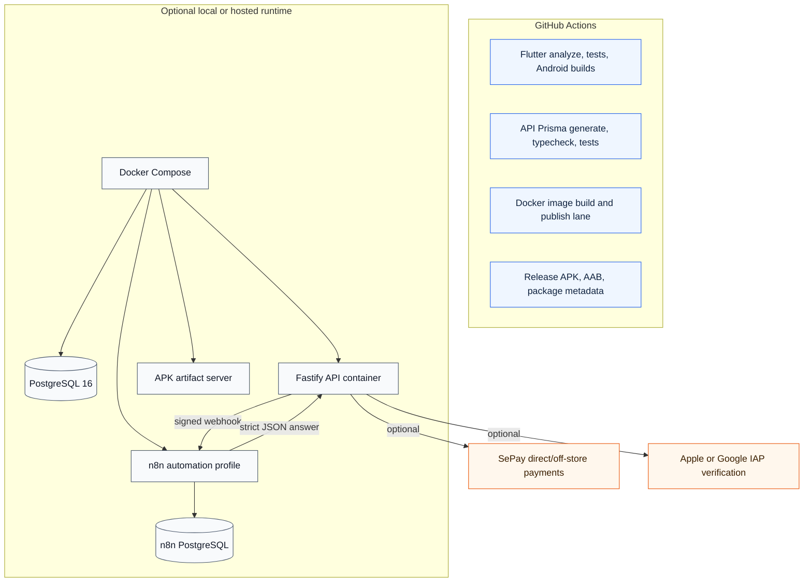

# System Diagrams

These Mermaid.js v11 diagrams summarize the CashFlow Manager runtime architecture, local-first data flow, optional sync, and automation boundaries.

## Runtime Architecture

## Local-First Data Flow

## Optional Account Sync

## Automation And Release Boundary

## Reading Notes

- The mobile app remains useful without account, network, PostgreSQL, n8n, or payment providers.
- PostgreSQL is never accessed directly from Flutter; all remote data access goes through the Fastify API and OpenAPI contract.
- Sync is optional and conflict-aware; failed remote operations must not delete or corrupt local finance data.
- n8n receives only the signed AI-analysis payload from the API, not hidden local app data.