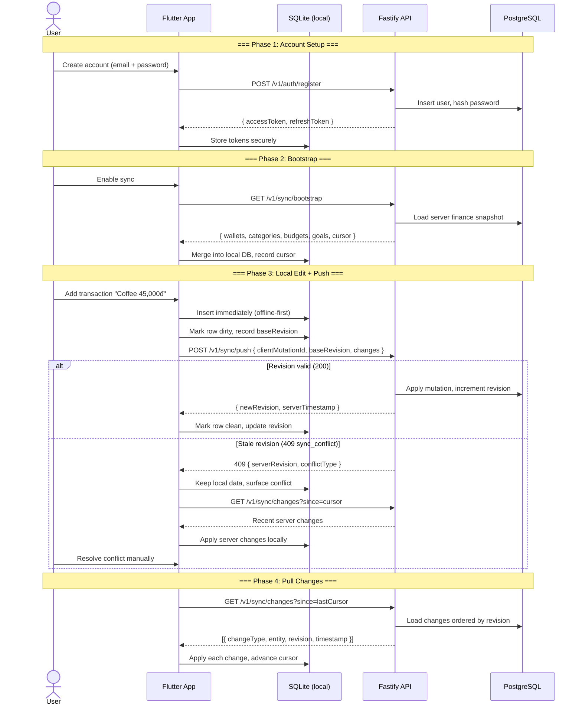
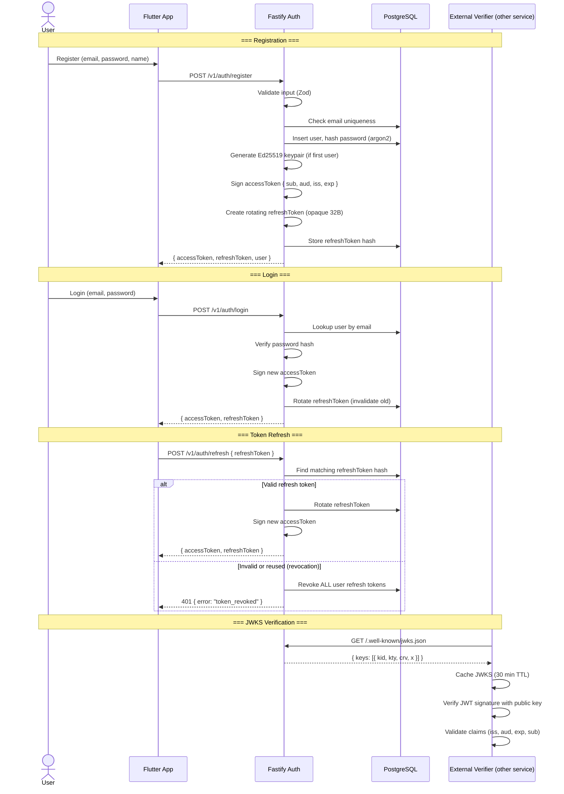
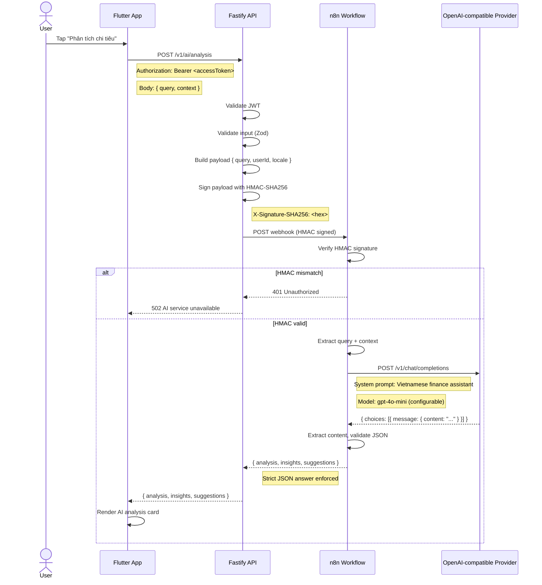
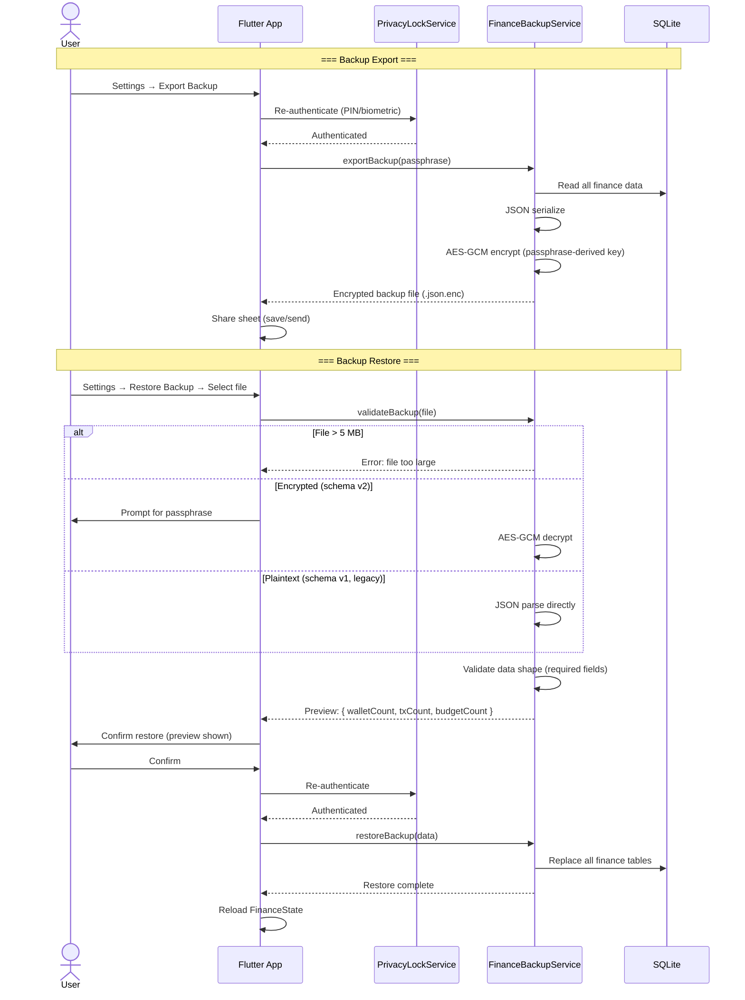
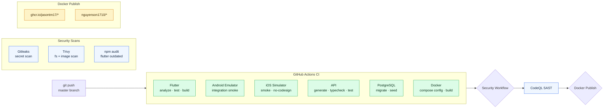
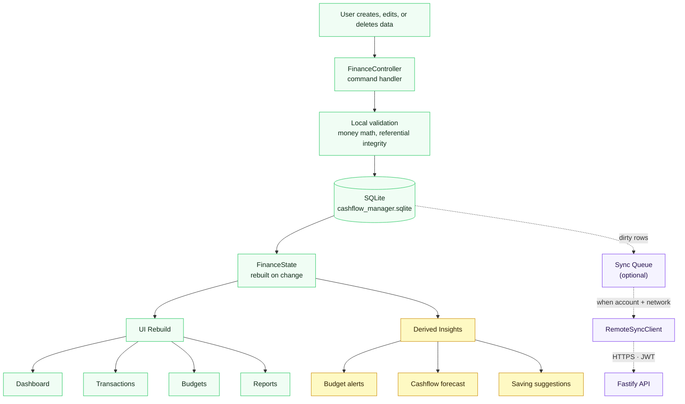

# System Diagrams / Sơ đồ hệ thống / システム図

Dynamic behavior diagrams: sync, auth, AI analysis, backup, and CI/CD flows. Mermaid.js v11.
For static architecture (C4 model), see [System Architecture](system-architecture.md).

---

## 1. Full Account Sync Flow

End-to-end sync: registration → bootstrap → changes → push → conflict resolution.

---

## 2. Authentication Flow

Register → Login → Token Refresh → JWKS Verification.

---

## 3. AI Analysis Flow

HMAC-protected API → n8n → OpenAI-compatible provider → response.

---

## 4. Backup & Restore Flow

Encrypted backup export + secure restore with preview.

---

## 5. CI/CD Pipeline Flow

---

## 6. Local-First Data Flow

---

## Reading Notes

- All diagrams use Mermaid.js v11 — render in any Mermaid-compatible viewer
- For static C4 architecture diagrams, see [System Architecture](system-architecture.md)
- For screen-level flows, see [UI Flow](ui-flow.md)
- For database schema details, see [Database Schema](database-schema.md)
- Export any diagram to PNG/SVG with `mermaid-cli` or the `/ck:tech-graph` skill
